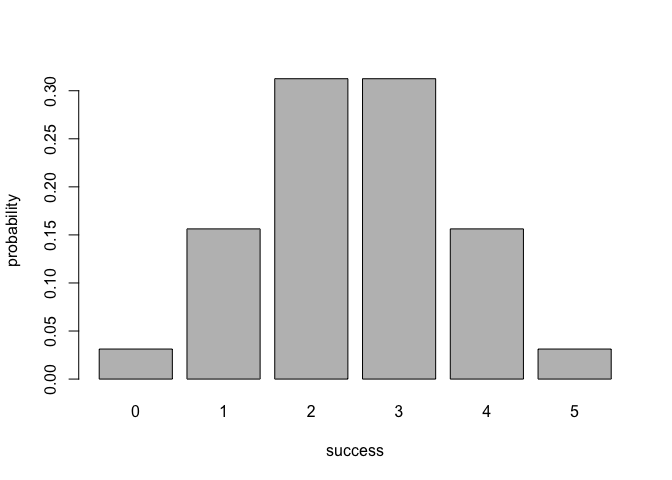
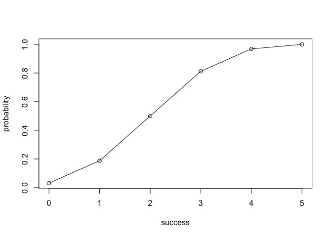

<!-- README.md is generated from README.Rmd. Please edit that file -->
Overview
--------

`"binomial"` is a minimal [R](http://www.r-project.org/) package that provides functions to calculate binomial distribution.

-   `bin_choose()` calculates the number of combinations in which k successes can occur in n trials.
-   `bin_probabilityn()` find the probability of getting the number of successs in trials with a probability
-   `bin_distribution()` creates a `"bindis"` class \*\* `plot()` to graph a barplot to display the probability histogram of a binomial distribution object `"bindis"`.
-   `bin_cumulative()` creates a `"bincum"` class \*\* `plot()` to graph the cumulative distribution in a object `bincum`.
-   `bin_variabl()` creates a `"binvar"` class \*\* `summary()` method for a `"binvar"` object.

Motivation
----------

The package `"binomial"` is a implementation for calculating probabilities of a Binomial random variable, and related calculations such as the probability distribution, the expected value, variance, etc.

Installation
------------

Install the development version from GitHub via the package `"devtools"`:

``` r
# development version from GitHub:
#install.packages("devtools") 
# install "cointoss" (without vignettes)
#devtools::install_github("https://github.com/stat133-sp19/hw-stat133-yuxiner/tree/master/binomial")
# install "cointoss" (with vignettes)
#devtools::install_github("https://github.com/stat133-sp19/hw-stat133-yuxiner/tree/master/binomial", build_vignettes = TRUE)
```

``` r
library(binomial)
```

Usage
-----

``` r
#calculates the number of combinations in which k successes can occur in n trials
bin_choose(n = 5, k = 2)
#> [1] 10


#find the probability of getting the number of successs in trials with a probability
# probability of getting 2 successes in 5 trials
# (assuming prob of success = 0.5)
bin_probability(success = 2, trials = 5, prob = 0.5)
#> [1] 0.3125


# binomial probability distribution
bin_distribution(trials = 5, prob = 0.5)
#>   success probability
#> 1       0     0.03125
#> 2       1     0.15625
#> 3       2     0.31250
#> 4       3     0.31250
#> 5       4     0.15625
#> 6       5     0.03125


# plotting binomial probability distribution
dis1 <- bin_distribution(trials = 5, prob = 0.5)
#>   success probability
#> 1       0     0.03125
#> 2       1     0.15625
#> 3       2     0.31250
#> 4       3     0.31250
#> 5       4     0.15625
#> 6       5     0.03125
plot(dis1)
```



``` r


# binomial cumulative distribution
bin_cumulative(trials = 5, prob = 0.5)
#>   success probability cumulative
#> 1       0     0.03125    0.03125
#> 2       1     0.15625    0.18750
#> 3       2     0.31250    0.50000
#> 4       3     0.31250    0.81250
#> 5       4     0.15625    0.96875
#> 6       5     0.03125    1.00000


# plotting binomial cumulative distribution
dis2 <- bin_cumulative(trials = 5, prob = 0.5)
#>   success probability cumulative
#> 1       0     0.03125    0.03125
#> 2       1     0.15625    0.18750
#> 3       2     0.31250    0.50000
#> 4       3     0.31250    0.81250
#> 5       4     0.15625    0.96875
#> 6       5     0.03125    1.00000
plot(dis2)
```



``` r


#nicely print the content of an object `binvar`
bin1 <- bin_variable(trials = 10, p = 0.3)
bin1
#> 
#> "Binomial variable"
#> 
#> Paramaters
#> - number of trials: 10
#> - prob of success: 0.3

#get a full summary description of an object `binvar`
bin1 <- bin_variable(trials = 10, p = 0.3)
binsum1 <- summary(bin1)
binsum1
#> 
#> "Summary Binomial"
#> 
#> Paramaters
#> - number of trials: 10
#> - prob of success: 0.3
#> 
#> Measures
#> - mean   : 3
#> - variance   : 2.1
#> - mode   : 3
#> - kurtosis   : -0.123809523809524

#measures
#The mean of a binominal distribution
bin_mean(10, 0.3)
#> [1] 3

#The variance of a binominal distribution
bin_variance(10, 0.3)
#> [1] 2.1

#The mode of a binominal distribution
bin_mode(10, 0.3)
#> [1] 3

#The skewness of a binominal distribution
bin_skewness(10, 0.3)
#> [1] 0.2760262

#The kurtosis of a binominal distribution
bin_kurtosis(10, 0.3)
#> [1] -0.1238095
```
