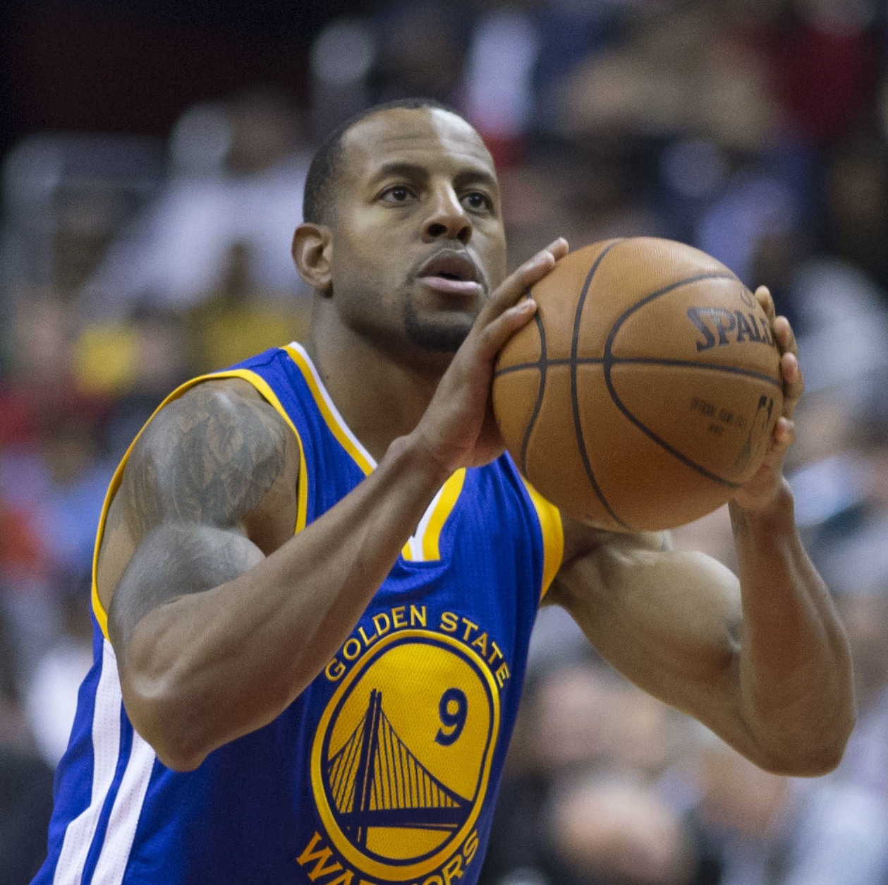
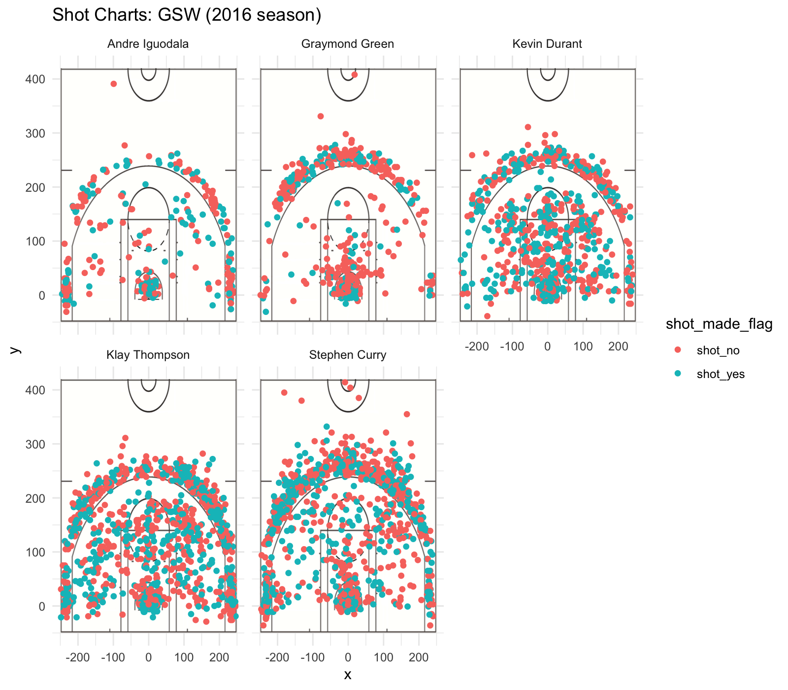

Workout01-yuxin-zhang
================
Yuxin Zhang

Introduction
============

With coach Cole joining the Golden State Warriors in the 2015 season, the Warriors changed the way they used to play in matches. Cole changed his usual tactics to ball tactics--the so-called "five small deaths". Cole boldly promoted Greene, Thompson and others, so that the Warriors in the 2015 season will be the championship. With the team more and more understanding in 2016, the Warriors created an unprecedented 73-9 regular season record, and no doubt to reach the finals. Unfortunately, the Finals met with Loeb. Lang James led the Cavaliers with a strong impedance. In the end, Warriors only missed the championship. In the summer of 2016, the Warriors brought in Thunder to turn Kevin Durant into a team without any dead ends overnight.
This paper takes the results of the Warriors in the regular season of 2016 as the research object, and discusses and analyses the main players'performance.

Main Players
============

Andre Iguodala
--------------



Andre Igodara is physically fit, bouncing amazingly, with a superhuman arm stretch. Attacking desire is not strong. Shooting is not very stable. Scoring is mostly through fast breaks and make-up.He often forced breakthroughs to create fouls. He is very active in defense, able to defend three positions outside the line. The rebounding ability is superior in the guard, the super long arm stretch makes him an all-round player.

Draymond Green
--------------


As the "glue" of the team, Drummond Green's greatest contribution lies in his rebounds. On the inside, Green's excellent vision and passing ability always make the defender lose points. Green's passing is always timely. Back to the basket, Green is a rather cunning player, and he's defensive to turn around the baseline or towards the penalty area. But Green doesn't have a particularly outstanding technology and is in an awkward position.

Kevin Durant
------------


His skill in ball control is exceptionally skillful, swift cross-over, turn, stop jump shot and other actions can only be seen on the guard. Shooting feels soft and can score anywhere in the field. No one can block his jump shot. The organizational ability and passing consciousness of the guard level can activate the attack of the whole team by one person. Rebounds are aggressive, especially offensive rebounds. The ability to control the ball is extremely rare in this height. Durant's most outstanding skill is his stable ability to shoot in the middle, no matter from the shooting action or shooting percentage he is impeccable. His free throw is also one of his strengths.

Klay Thompson
-------------

 Projection is Clay Thompson's greatest value, but Thompson's offensive skills are relatively single, lack of being skilled in ball control. Thompson can't play the role of the ball-holder. He's more like a catching and shooting machine. Thompson seldom goes to the penalty area, because the technique of independent attack is not good enough, it is difficult to get a free throw.

Stephen Curry
-------------


Stephen Cooley is good at dribbling and jump shots, and shooting can cover the whole half. He is excellent at ball control, one-to-one through ball control to find out the mobile position, and has a large number of three points. Because of his thin body, Kuri is not easy to enter the restricted area and lacks aggression.

> "Stephen Cooley's skill is quite comprehensive. He can create mobile phone opportunities by dribbling balls, catch jump shots after running, and shoot at fixed points. It's no problem to combine these abilities. That's his specialty."

Data Analysis and Technical Graphics
====================================



``` r
library(dplyr)
```

    ## 
    ## Attaching package: 'dplyr'

    ## The following objects are masked from 'package:stats':
    ## 
    ##     filter, lag

    ## The following objects are masked from 'package:base':
    ## 
    ##     intersect, setdiff, setequal, union

``` r
shots <- read.csv(file = "../data/shots-data.csv",stringsAsFactors = FALSE)
PT2_shots <- shots %>%
  filter(shot_type == "2PT Field Goal") %>%
  group_by(name) %>%
  summarize(total = n(), made = length(shot_type[shot_made_flag =="shot_yes"])) %>%
  mutate(perc_made = made / total) %>%
  arrange(desc(perc_made))
PT2_shots 
```

    ## # A tibble: 5 x 4
    ##   name           total  made perc_made
    ##   <chr>          <int> <int>     <dbl>
    ## 1 Andre Iguodala   210   134     0.638
    ## 2 Kevin Durant     643   390     0.607
    ## 3 Stephen Curry    563   304     0.540
    ## 4 Klay Thompson    640   329     0.514
    ## 5 Graymond Green   346   171     0.494

``` r
PT3_shots <- shots %>%
  filter(shot_type == "3PT Field Goal") %>%
  group_by(name) %>%
  summarize(total = n(), made = length(shot_type[shot_made_flag =="shot_yes"])) %>%
  mutate(perc_made = made / total) %>%
  arrange(desc(perc_made))
PT3_shots 
```

    ## # A tibble: 5 x 4
    ##   name           total  made perc_made
    ##   <chr>          <int> <int>     <dbl>
    ## 1 Klay Thompson    580   246     0.424
    ## 2 Stephen Curry    687   280     0.408
    ## 3 Kevin Durant     272   105     0.386
    ## 4 Andre Iguodala   161    58     0.360
    ## 5 Graymond Green   232    74     0.319

``` r
effective_shots <- shots %>%
  group_by(name) %>%
  summarize(total = n(), made = length(shot_type[shot_made_flag =="shot_yes"])) %>%
  mutate(perc_made = made / total) %>%
  arrange(desc(perc_made))
effective_shots
```

    ## # A tibble: 5 x 4
    ##   name           total  made perc_made
    ##   <chr>          <int> <int>     <dbl>
    ## 1 Kevin Durant     915   495     0.541
    ## 2 Andre Iguodala   371   192     0.518
    ## 3 Klay Thompson   1220   575     0.471
    ## 4 Stephen Curry   1250   584     0.467
    ## 5 Graymond Green   578   245     0.424

Comprehensive use of data analysis and charts to analyze the characteristics of each player
-------------------------------------------------------------------------------------------

A good team bound to have excellent players.The analysis of five major players is as follows.

-   Andre Iguodala The percentage of shooting is not low and the ball right in his hand is low. But the two-point shooting rate is very high. Because the number of shots is small, which is not a conventional scoring point and just because the opponent's defensive force in these positions is weak. So sometimes there will be vacancies, leading to a higher hit rate. From the shot charts, we also can see in fact, the dunk of Andre Iguodala has always been very explosive, in the warriors, can be said to be the first.

-   Draymond Green The percentage of shooting is very low and the ball right in hand is also low. And the shooting percentage is low. His main role of the team is to connect the team and defence.Green doesn't have an excelent technology on shooting, while he is good at defensing.Drummond Green is a top forward defender, able to defend multiple positions on the outside line; shooting is unstable and difficult to end the offense; rebounds are excellent.

-   Kevin Durant As the main offensive point, his offensive ability is strong, the number of effective attacks is most high, especially the 2-points shots. His offensive firepower radiation all-round, is able to get scoring point in any position of the court. What's more, his single ability is worth mentioning.

-   Klay Thompson Thompson is the main three-point shooter in the team, and be allocates more ball power. As the end of offensive tactics, and the shooting percentage is very high. His shooting area is also large.Klay has made 1220 shots in the regular season, in exchange for a very high 47.13115% shooting percentage. Clay has polished his skilled free-space shooting and fixed three-point shooting skills after running without the ball. The highest percentage of three-point shooting is 42%, which is the best proof.

-   Stephen Curry Curie is also the team's main three-point shooter, and is very similar with Thompson in shooting. The team allocates high ball power on him, and shooting percentage is very high. Specially, his shooting position is very far from the basketball hoop，even to the midfield line.He has excellent three-point shots that make him one of the most horrible scorers in the league.

Analysis of Team's Overall Strength
-----------------------------------

With Kevin Durant's joining, the warriors can attack without dead corners. They can be said to be invincible and defensible. The Warriors have half of the dream team players, too many offensive points, Kevin Durant, Stephen Curry and Clay Thompson are all reliable scoring points.At the same time, the points also come from the contribution of Andre Iguodala and Draymond Green. From the analysis of effective shooting, it is precisely because of the stable play of the five players that the Warriors have amazing results.Kevin Durant, Klay Thompson and Stephen Curry have the ability to shoot from the outside. Thompson and Berlin's breakthrough and scoring not only caused great harm to their opponents, but also created many opportunities for their teammates to shoot in the open.

Discussion and Conclusions
==========================

The Warriors'players are reasonably allocated. The main players not only have abundant competition experience, but also have outstanding personal abilities. They can organize attacks effectively and attract opponents to create open shooting opportunities for their teammates.
